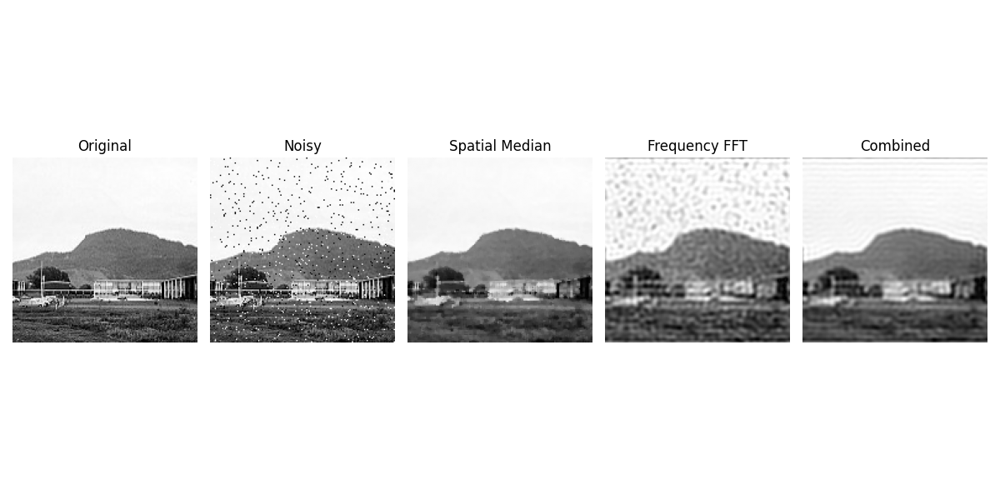
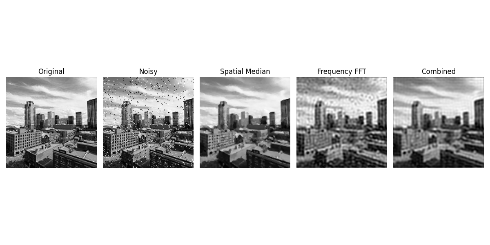
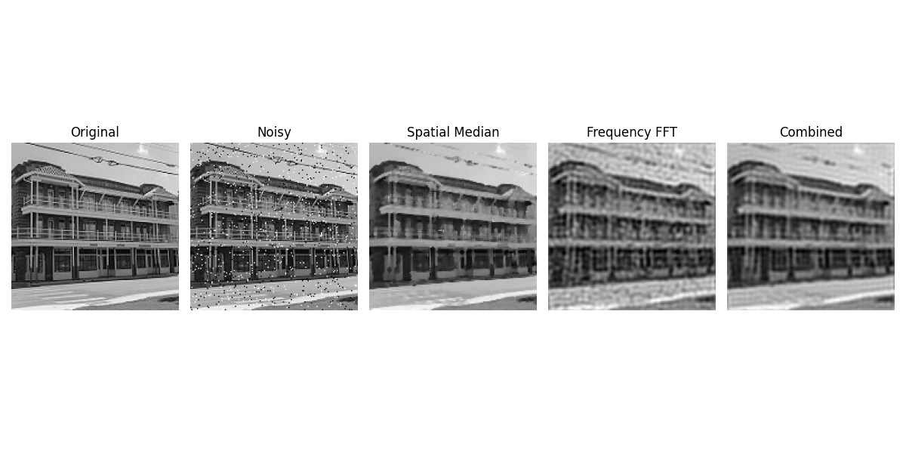
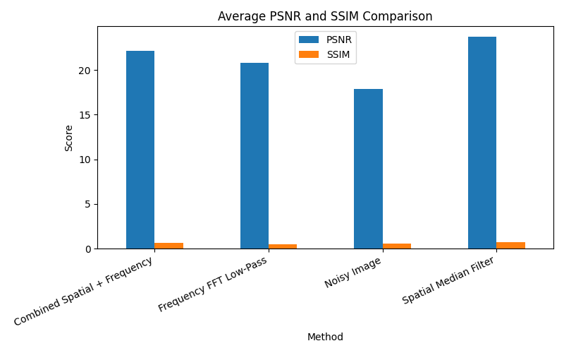

# Image Enhancement Project

This project explores image enhancement using:
- Spatial Domain (Median Filter)
- Frequency Domain (FFT)
- Combined Methods

## Dataset
Intel Image Classification Dataset

## Evaluation Metrics
- PSNR (Peak Signal-to-Noise Ratio)
- SSIM (Structural Similarity Index)

## Results
- Spatial Median Filter performed best
- Combined method showed moderate improvement
- Frequency method caused blurring

  ### Sample Outputs

### Performance Comparison

